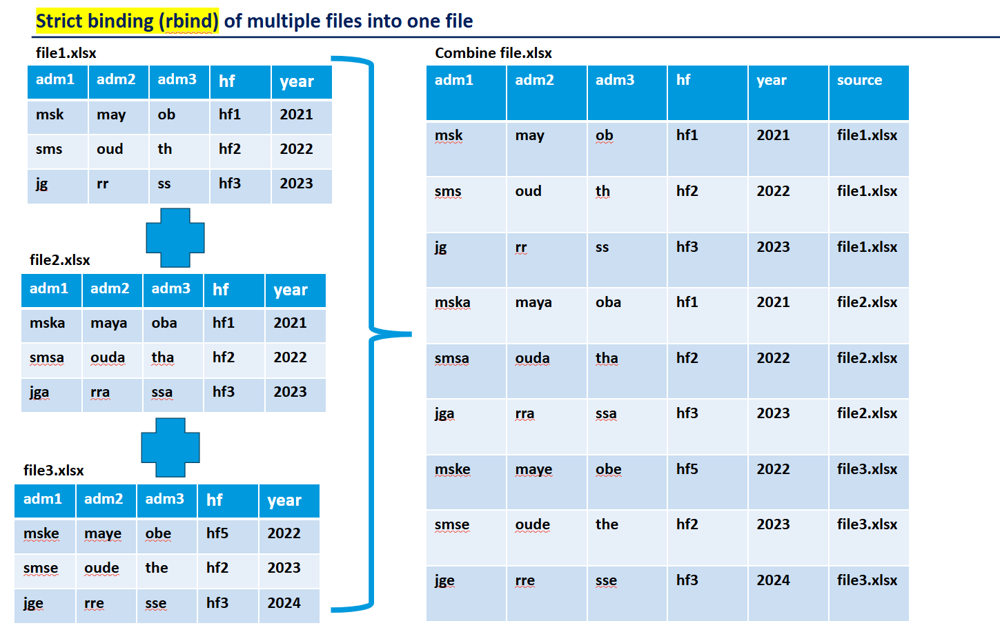

**This is a section that talks about how to combine multiple files of the same variables or columns into one**
## Method

**This is one method how to combine files**   





## Code 

```python
import pandas as pd

# Direct raw CSV link from GitHub
url = "https://raw.githubusercontent.com/mohamedsillahkanu/Code-Repository/main/CHIRPS_Mean_2015_11.csv"

# Read the CSV
df = pd.read_csv(url)

# Show first 10 rows in HTML format
html_table = df.head(10).to_html(index=False)

# Save to an HTML file
with open("output.html", "w", encoding="utf-8") as f:
    f.write(html_table)

print("HTML table saved as 'output.html'")
```
## Malaria Surveillance Dashboard

| District | Cases 2024 | Status | Trend | Completion |
|----------|------------|--------|-------|------------|
| **Western Area** | 15,420 | ✅ Complete | 📈 +2.3% | 98.5% |
| **Eastern Province** | 22,180 | ⚠️ Review | 📉 -1.8% | 89.2% |
| **Northern Province** | 18,750 | ✅ Complete | 📈 +5.1% | 95.7% |
| **Southern Province** | 12,340 | 🔄 Processing | 📊 Stable | 76.8% |

